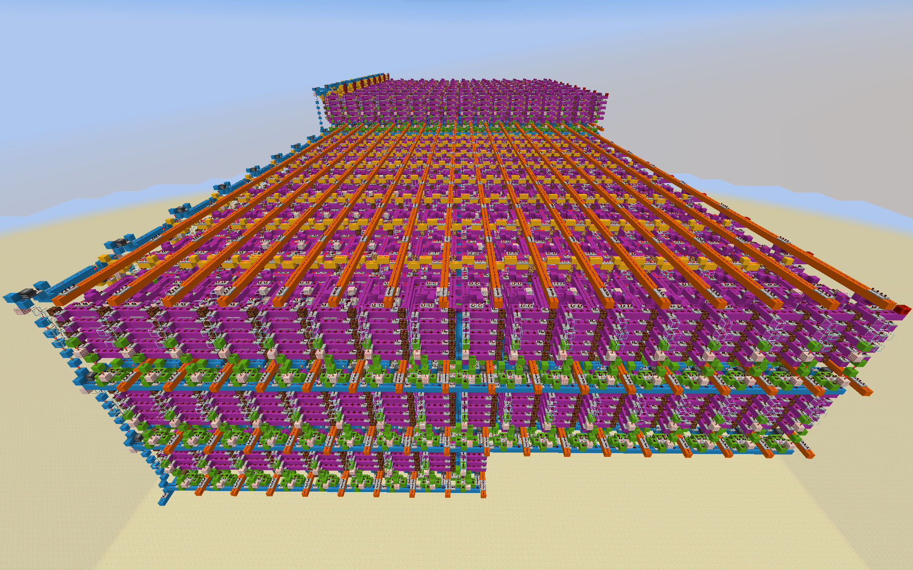
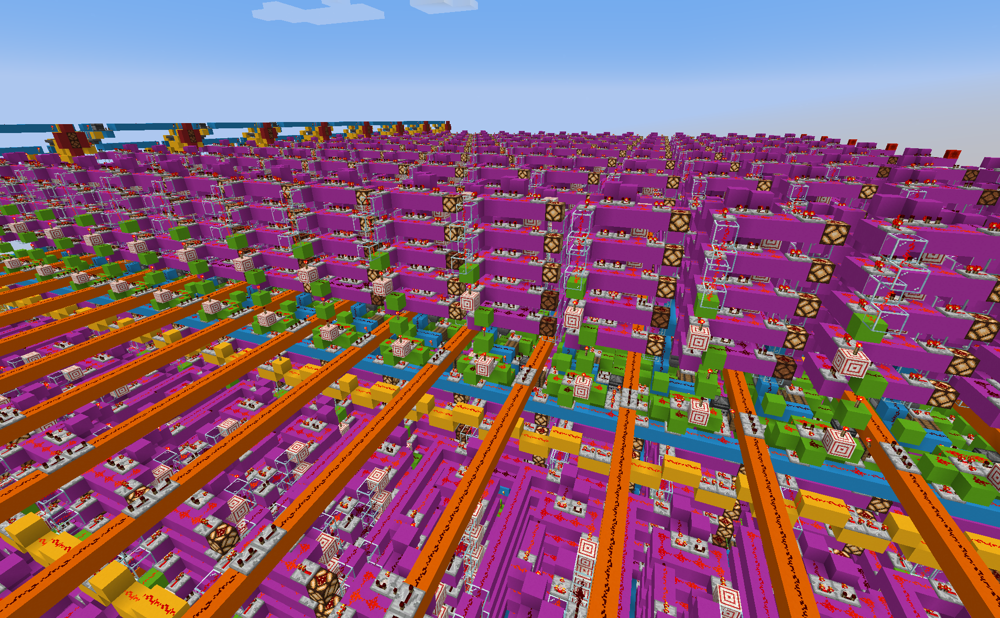
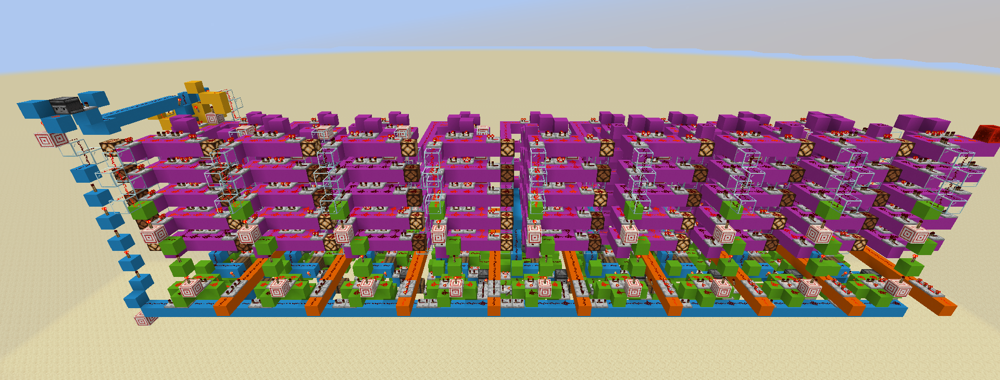
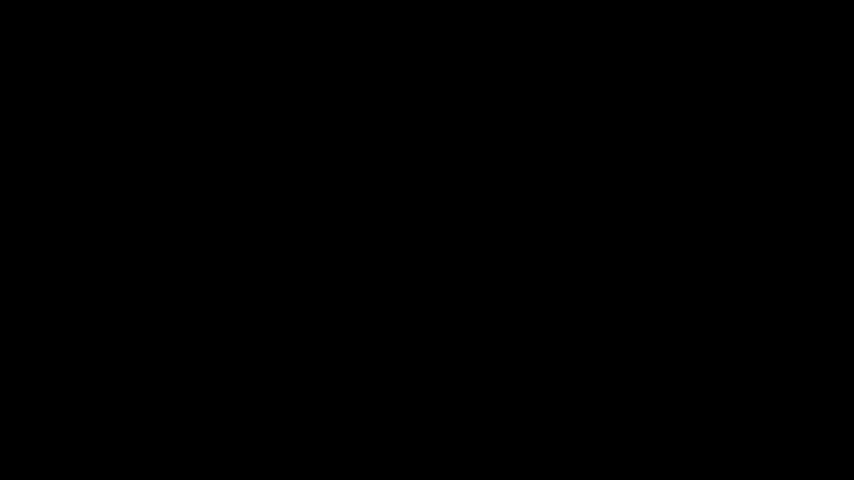
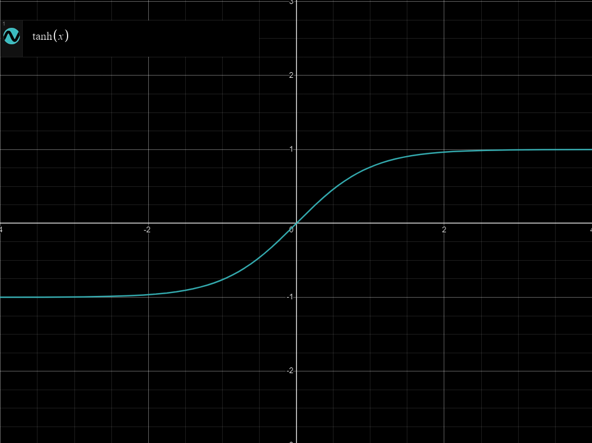
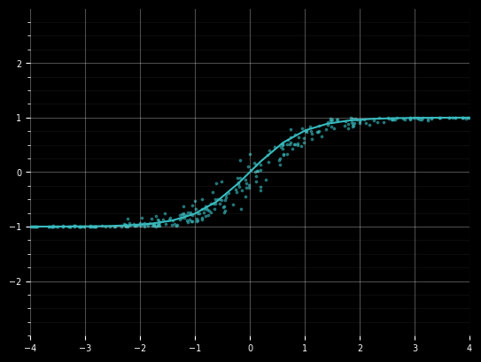

# MineNewt: Neural Networks in Minecraft

MineNewt is a neural network created from scratch in Minecraft using redstone. The network is first compiled using a custom rust library, and is then dynamically generated into a Minecraft world. This allows users to train neural networks on arbitrary functions and import them into Minecraft, effectively acting as a Rust compiler targeting Minecraft.

- [Gallery](#gallery)
- [The Software](#the-software)
- [The Math](#the-math)
- [Getting Started](#getting-started)
- [Usage](#usage)
- [Contributing](#contributing)

## Gallery


<p align="center"><strong>An example network</strong></p>
<p align="center">This is a network with 64 total neurons that adds two binary numbers and computes their modulus in base 3, 5, and 7. It could in theory compute any compatible Rust function though</p>

<br><br>


<p align="center"><strong>Closer view of example network</strong></p>
<p align="center">You can see the different components that make up the network, including the activation functions (purple), the weight functions (green), clock lines (blue), and inputs and outputs (orange/yellow)</p>

<br><br>


<p align="center"><strong>Weight & Addition</strong></p>
<p align="center">This is one component of a neuron. It is responsible for computing instant-carry addition on a binary input with either -1 or 1, given a weighted input</p>

<br><br>


<p align="center"><strong>Full Neuron</strong></p>
<p align="center">This is the equivalent of one neuron. It takes in 8 inputs, and multiplies each by a weight. It then computes its activation and applies a smoothing function</p>

## The Software


MineNewt is composed of three main components:

1. **Training**: A neural network library built in Rust that compiles Rust functions into deep neural networks and exports them as `.newt` files, which represent the network's weights and biases.

2. **Simulation**: This stochastic neural network simulator takes in a `.newt` file and simulates the accuracy of the Minecraft-based neural network. By running thousands of simulations, it provides insight into the network's robustness and accuracy in the Minecraft environment.

3. **Generation**: A Python library that modifies Minecraft world data, building the neural network from scratch given a `.newt` file. This creates a world file with the final neural network.

## The Math

**The following is an introductory explanation that assumes you have a basic understanding of neural networks, binary, and boolean algebra**

Minecraft redstone is an exceptionally limited way to encode a neural network. It is barely turing-complete via [Pierce Logic](https://en.wikipedia.org/wiki/Logical_NOR), and has an operation time of 0.1s. This means that time and space complexity it critical to the design of the network.

The biggest challenge in building a neural network in Minecraft is the representation of accurate floating point numbers. A binary representation like IEEE-754 would be unweildly, due to the complexity of implementing floating point operations in Minecraft. This could take seconds to compute even a single operation, and would require a massive amount of space (as each of the 768 connections would require an individual bus to represent its state). Thus, we utilize **stochastic computing**, where instead of representing a floating point number as any fixed set of bits, we sample the line at various intervals and use the probability of it being on to represent the number.



We will represent all the floating point numbers $f \in [-1, 1]$ (decimal numbers between -1 and 1) by

$$f = 2p - 1$$

where $p$ is the probability of the line being on. 

We need to derive methods for multiplication by a constant and a nonlinear activation sum (adding numbers and applying an activation function) in order to implement a neural network. 

### Multiplication
Multiplication is easy, because it is a linear operation, we can consider cases on individual bits.

$f_1$ | $f_2$ | $f_1 \times f_2$
:---: | :---: | :---:
-1  | -1  | 1
-1 | 1 | -1
1 | -1 | -1
1 | 1 | 1

Converting these with our above representation gives us a truth table for the probabilities in our bitstream

$p_1$ | $p_2$ | $p_1 \otimes p_2$
:---: | :---: | :---:
0  | 0  | 1
0 | 1 | 0
1 | 0 | 0
1 | 1 | 1

So, in this system, we find that multiplication is simply the XNOR of the two bitstreams!

### Activation

Computing an activation function is more difficult. Because we can only represent numbers on $[-1, 1]$, any function on our domain must be of the form $\psi : [-1, 1]^N \to [-1, 1]$, so we cannot simply implement addition as $1 + 1 = 2$ would overflow our probability (we cannot have a 200% probability of a bit being on!). So, we need to compute the sum of the weighted inputs and our activation function at the same time.

$$\psi(x_1, x_2, \cdots, x_n) = \tanh\left(\sum_{i=1}^n x_i + c\right)$$

We choose a function of the form $\tanh(x + c)$ because it cleanly fills our working domain of $[-1, 1]$



We can approximate this function with a binary step function
$$\tanh\left(\sum x_i\right) \approx \begin{cases}-1 \;\text{ if } \sum x_i < 0\\1 \;\text{ otherwise}\end{cases}$$
Observe that if the total number of ones in $\mid\mid_{i = 1}^n x_i$ (concatenating all inputs) is greater than the total number of zeros, then the sum will be positive. 


Evaluating over the infinite bitstream, this would yield a binary step function. However, this would also take an infinite amount of time, and be difficult to train. So, we take a rolling sum, clamping our values to $[-log_2(n), log_2(n)]$ (where $n$ is the number of inputs). This gives us a close approximation of $tanh(x)$ (and indeed approaches $tanh(x)$ as $n \to \infty$). 



## Getting Started

### Prerequisites
- [Rust](https://www.rust-lang.org/) (latest version)
- [Python](https://www.python.org/downloads/) (3.6 or later)
- [Minecraft](https://www.minecraft.net/en-us/get-minecraft) (Java Edition 1.16+)

### Quick Start

1. Clone this repository:
```
git clone https://github.com/expitau-dev/MineNewt.git
cd MineNewt
```

2. Train the neural network
```
cd training
cargo run -r
cd -
```

3. Generate the minecraft world
```
cd generation
python3 src/main.py
cd -
```

4. Copy the generated world to your Minecraft folder
```
cp -r generation/saves/output MINECRAFT_SAVES_DIRECTORY
```

## Usage

1. **Training Neural Networks**: Use the training library to train a network on a Rust function. Save your network with the `.newt` extension.

```rust
let _network = train_network(
  vec![8, 16, 16, 16, 8], // Network architecture, this one is a 8 -> 16 -> 16 -> 16 -> 8 network
  FloatDataFunction {
      f: Box::new(test_function), // The function to train on
      size: (8, 8), // The size of the inputs / outputs of the function
  },
  20, // Number of epochs
);

// Save the network to a file
let mut file = File::create("../example.newt").unwrap(); 
file.write_all(_network.to_string().as_bytes()).unwrap();
```

1. **(Optional) Simulating Networks**: Use the simulation library to run simulations on your trained network.

```rust
let network_data = read_neural_net_file(Path::new("../example.newt")).unwrap();

let input = vec![1.0, 1.0, 1.0, 1.0, -1.0, -1.0, -1.0, 1.0];

let output = propagate(&network_data, &input);
println!("{:?}", output);
```

1. **Generating Minecraft Worlds**: Use the generation library to create a Minecraft world from your trained network.

```python
from editor import world
from schema import network
import load

myWorld = world.World('saves/input')
networkData = load.read_neural_net_file('../example.newt')

network.network(networkData).write(myWorld, (0, 60, 0))

myWorld.close('saves/output')
```

This will create a world in "generation/saves/output" that contains the neural network. You can then copy this world to your Minecraft saves folder.

## Contributing

Please contribute! Submit garbage pull requests! I'm not picky.


[def]: #minenewt-neural-networks-in-minecraft
