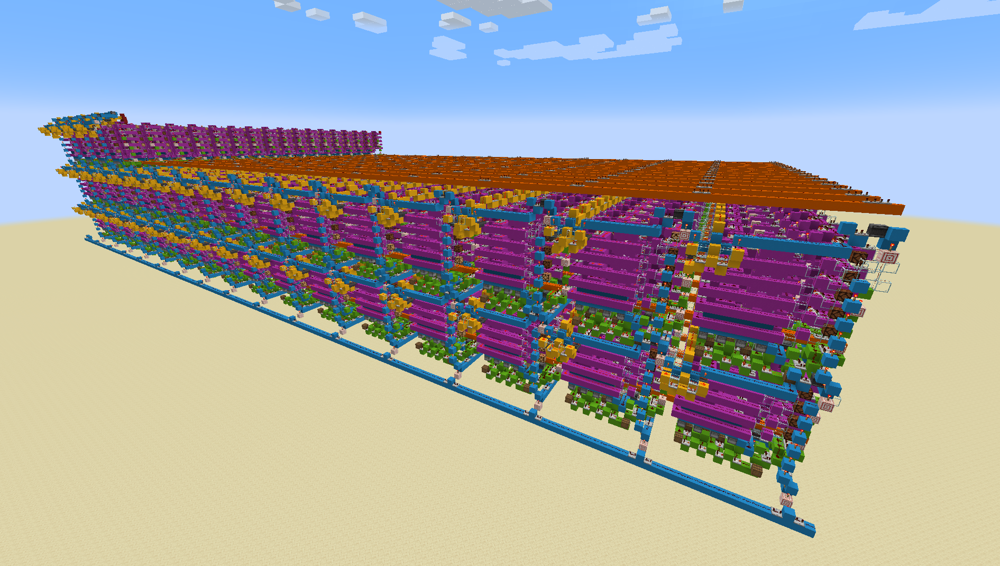
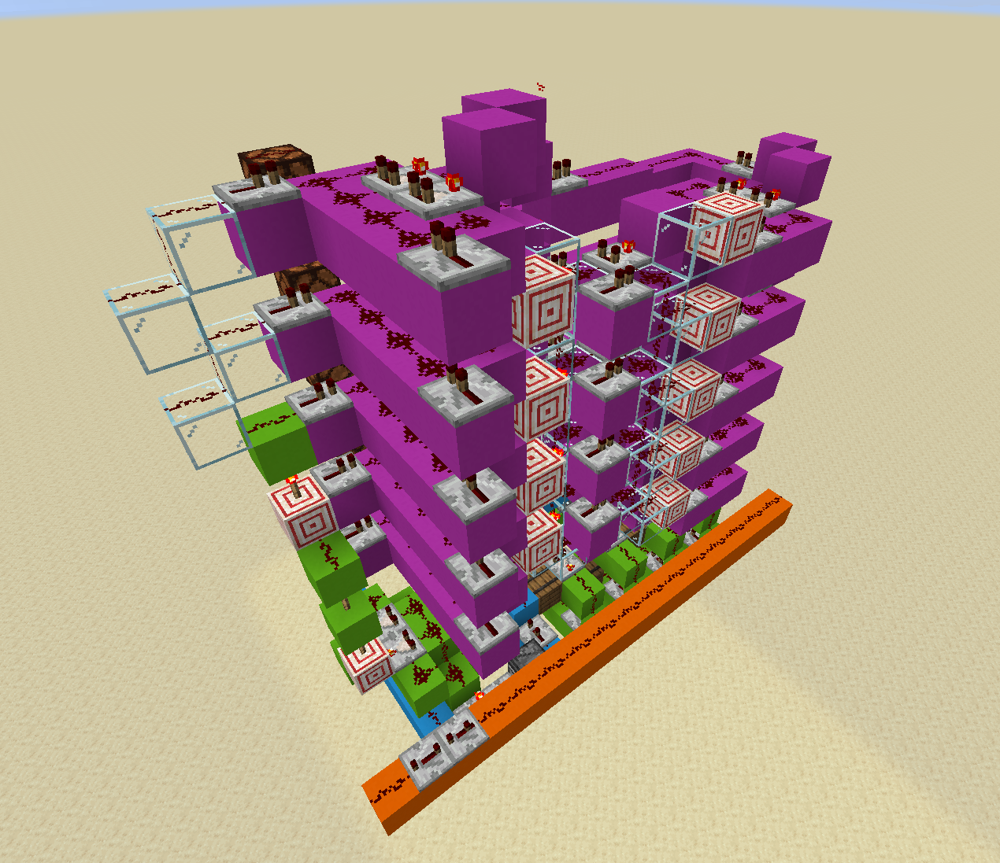
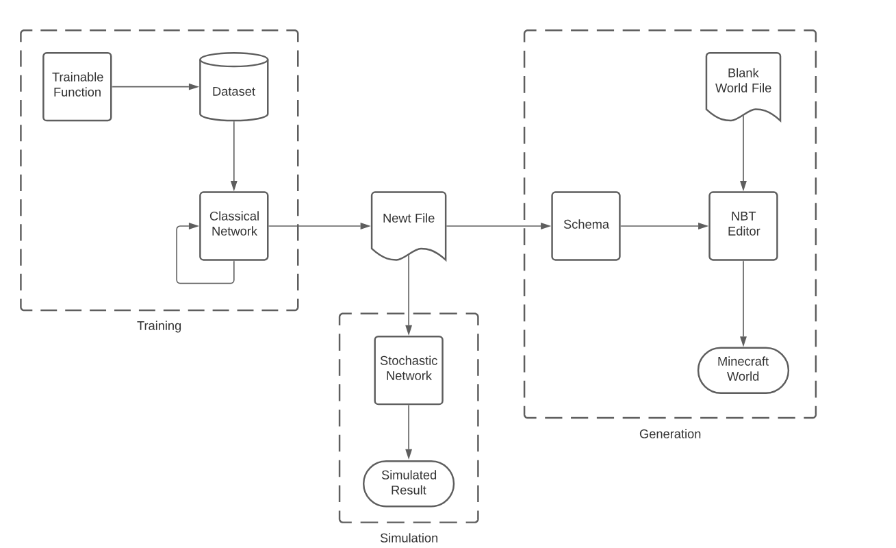
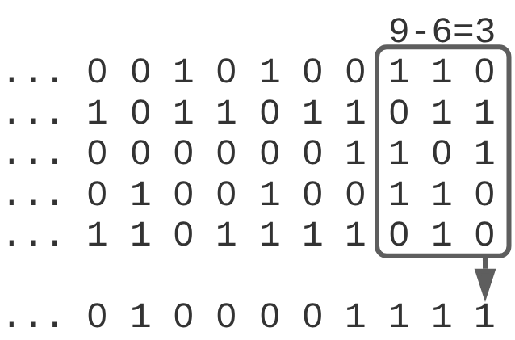

# MineNewt: Neural Networks in Minecraft

MineNewt is a neural network created from scratch in Minecraft using redstone. The network is first compiled using a custom rust library, and is then dynamically generated into a Minecraft world. This allows users to train neural networks on arbitrary functions and import them into Minecraft, effectively acting as a Rust compiler targeting Minecraft.

- [Gallery](#gallery)
- [The Software](#the-software)
- [The Math](#the-math)
- [Getting Started](#getting-started)
- [Usage](#usage)
- [Contributing](#contributing)

## Gallery


<p align="center"><strong>An example network</strong></p>
<p align="center">This is a network with 64 total neurons that adds two binary numbers and computes their modulus in base 3, 5, and 7. It could in theory compute any compatible Rust function though</p>

<br><br>


<p align="center"><strong>Closer view of example network</strong></p>
<p align="center">You can see the different components that make up the network, including the activation functions (purple), the weight functions (green), clock lines (blue), and inputs and outputs (orange/yellow)</p>

<br><br>


<p align="center"><strong>Weight & Addition</strong></p>
<p align="center">This is one component of a neuron. It is responsible for computing instant-carry addition on a binary input with either -1 or 1, given a weighted input</p>

<br><br>


<p align="center"><strong>Full Neuron</strong></p>
<p align="center">This is the equivalent of one neuron. It takes in 8 inputs, and multiplies each by a weight. It then computes its activation and applies a smoothing function</p>

## The Software



MineNewt is composed of three main components:

1. **Training**: A neural network library built in Rust that compiles Rust functions into deep neural networks and exports them as `.newt` files, which represent the network's weights and biases.

2. **Simulation**: This stochastic neural network simulator takes in a `.newt` file and simulates the accuracy of the Minecraft-based neural network. By running thousands of simulations, it provides insight into the network's robustness and accuracy in the Minecraft environment.

3. **Generation**: A Python library that modifies Minecraft world data, building the neural network from scratch given a `.newt` file. This creates a world file with the final neural network.

## The Math

Minecraft redstone is an exceptionally limited way to encode a neural network. Given essentially only the boolean OR and NOT operators, and an operation time of 1/10th of a second, we need to be inventive to ensure that the resulting structure is not too large or takes too long to compute.

The biggest challenge in building a neural network in Minecraft is the representation of accurate floating point numbers. A binary representation like IEEE-754 would be unweildly, due to the complexity of implementing floating point operations in Minecraft. This could take seconds to compute even a single operation, and would require a massive amount of space (as each of the 768 connections would require an individual bus to represent its state). 

Instead, we need a way to represent a floating point number with only a single redstone line. I chose to use stochastic computing for this, representing a $-1$ as a 0% chance of a redstone line being on, a $0$ as a 50% chance of it being on, and a $1$ as a 100% chance of it being on. To create a neural network in this system, we need to show that it is possible to implement two operations: floating point multiplication, and an activation function.

Multiplication is easy. If we have to probabilities $p_1$ and $p_2$ of bitstreams $b_1$ and $b_2$, then $b_1 \land b_2$ will have a $p_1 \times p_2$ probability of being on when $0 \leq p_1, p_2 \leq 1$. 


Observe that when we extend this representation from $[0, 1]$ to $[-1, 1]$, multiplication by opposite signs results in a low sign, and multiplication by the same sign results in a high sign. So, multiplication on this system is represented by $b_1 \odot b_2$ (XNOR), which can be easily implemented in Minecraft.

However, computing an activation function is more difficult. We will aim for tanh, as it can be used effectively both for hidden and output layers. We need to both compute the sum of the weighted inputs, as well as the activation itself. There is no sum function on stochastic numbers (as it is not closed on [-1, 1]), so we need to do both of these steps at once. We observe that the sum of different stochastic numbers is greater than zero when there are more $1$s than $0$s in a combined bitstream, and vice-versa.



Computing this with the sum of every bit would yield a binary step function, so instead we "smooth" it by taking a rolling average. With some experimentation, we find that a rolling average of $\log_2(n)$ bits (where $n$ is the number of inputs) gives a function of $\tanh(x - 1)$, which is suitable for activation.

## Getting Started

### Prerequisites
- [Rust](https://www.rust-lang.org/) (latest version)
- [Python](https://www.python.org/downloads/) (3.6 or later)
- [Minecraft](https://www.minecraft.net/en-us/get-minecraft) (Java Edition 1.16+)

### Quick Start

1. Clone this repository:
```
git clone https://github.com/expitau-dev/MineNewt.git
cd MineNewt
```

2. Train the neural network
```
cd training
cargo run -r
cd -
```

3. Generate the minecraft world
```
cd generation
python3 src/main.py
cd -
```

4. Copy the generated world to your Minecraft folder
```
cp -r generation/saves/output MINECRAFT_SAVES_DIRECTORY
```

## Usage

1. **Training Neural Networks**: Use the training library to train a network on a Rust function. Save your network with the `.newt` extension.

```rust
let _network = train_network(
  vec![8, 16, 16, 16, 8], // Network architecture, this one is a 8 -> 16 -> 16 -> 16 -> 8 network
  FloatDataFunction {
      f: Box::new(test_function), // The function to train on
      size: (8, 8), // The size of the inputs / outputs of the function
  },
  20, // Number of epochs
);

// Save the network to a file
let mut file = File::create("../example.newt").unwrap(); 
file.write_all(_network.to_string().as_bytes()).unwrap();
```

1. **(Optional) Simulating Networks**: Use the simulation library to run simulations on your trained network.

```rust
let network_data = read_neural_net_file(Path::new("../example.newt")).unwrap();

let input = vec![1.0, 1.0, 1.0, 1.0, -1.0, -1.0, -1.0, 1.0];

let output = propagate(&network_data, &input);
println!("{:?}", output);
```

1. **Generating Minecraft Worlds**: Use the generation library to create a Minecraft world from your trained network.

```python
from editor import world
from schema import network
import load

myWorld = world.World('saves/input')
networkData = load.read_neural_net_file('../example.newt')

network.network(networkData).write(myWorld, (0, 60, 0))

myWorld.close('saves/output')
```

This will create a world in "generation/saves/output" that contains the neural network. You can then copy this world to your Minecraft saves folder.

## Contributing

Please contribute! Submit garbage pull requests! I'm not picky.


[def]: #minenewt-neural-networks-in-minecraft
